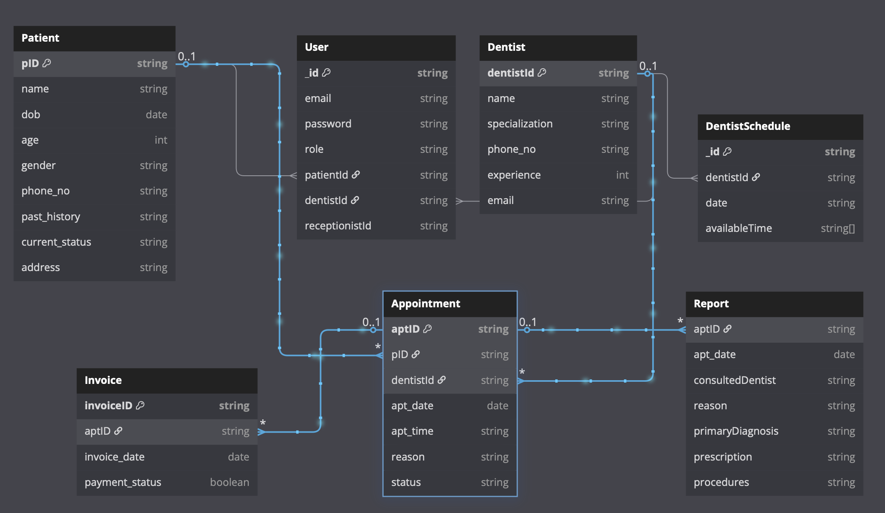

# Dental Clinic Management System – DBMS Project

This project is a web-based Dental Clinic Management System built as part of a DBMS course. It facilitates efficient management of appointments, patient records, dentist schedules, payments, and reports within a dental clinic environment.

## Table of Contents

1. [Features](#features)
2. [Tech Stack](#tech-stack)
3. [System Architecture](#system-architecture)
4. [Database Schema](#database-schema)
5. [Installation](#installation)
6. [Usage Workflow](#usage-workflow)
7. [Future Improvements](#future-improvements)
8. [Live Website](#live-website)

## Features

- Patient signup/login and profile completion
- Receptionist(Admin)-driven patient registration
- Dentist profile and appointment scheduling
- Appointment booking and tracking
- Medical report upload and viewing
- Invoice generation and Razorpay payment integration
- Role-based access: Patient, Receptionist(Admin), Dentist


## Tech Stack

**Client:** React, TailwindCSS

**Server:** Node.js, Express.js

**Database**: MongoDb

**Authentication**: JWT

**Payment Gateway**: Razorpay (Test Mode)

## System Architecture

```
Frontend <-> Backend API <-> MongoDB
            |
          Auth Middleware
            |
        Role-based Routing
```

## Database Schema



## Installation

1. Clone the repo
```bash
  git clone https://github.com/varunbalaji167/Dental_DBIS.git
  cd Dental_DBIS
```

2. Set up environment variables
- In root of server
```bash
MONGO_URI=<your-mongodb-uri>
JWT_SECRET=<your-secret>
RAZORPAY_KEY_ID=<your-key-id>
RAZORPAY_KEY_SECRET=<your-key-secret>
```    
- In root of client
```bash
VITE_API_BASE_URL=http://localhost:3000/api/
```

3. In split terminals
```bash
    cd server
    npm install
    nodemon server.js
```
```bash
    cd client
    npm install
    npm run dev
```

## Usage Workflow

### Patient
- Sign up with email and password  
- Complete profile  
- Book appointments  
- View and print medical reports  
- View, print and pay invoices   

### Dentist
- Log in with credentials  
- Create his schedule of appointments
- View appointments  
- Upload diagnosis and reports  

### Receptionist (Admin)
- Log in with credentials  
- Create patient profiles  
- Manage patients appointments 
- Manage patients reports, invoices
- Manage patients and dentists records

## Future Improvements

- Email/SMS notifications
- Appointment reminders via SMS
- Advanced Analytics
- Video call or chat facilities

## Live Website

**Live URL**: [Smilify](https://smilify-xijm.onrender.com)